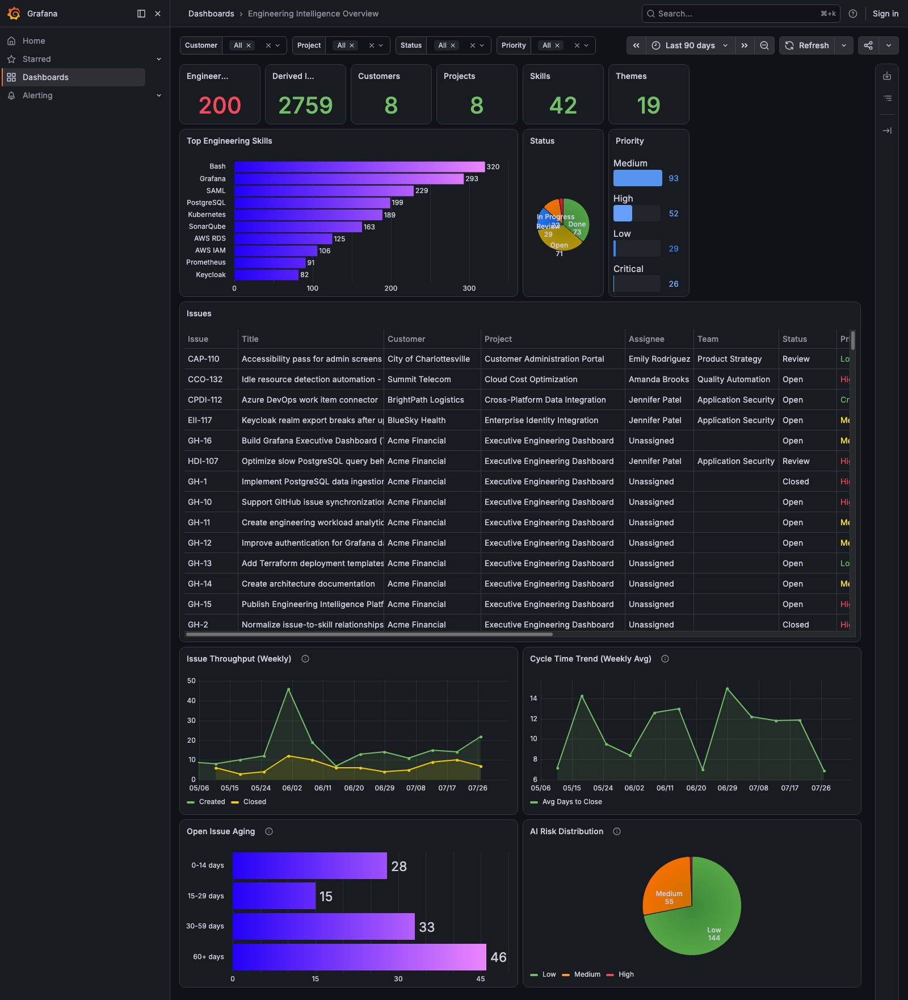
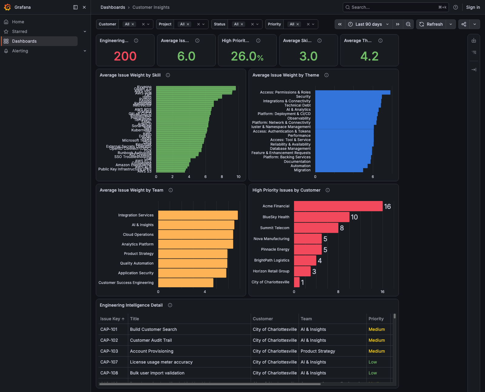
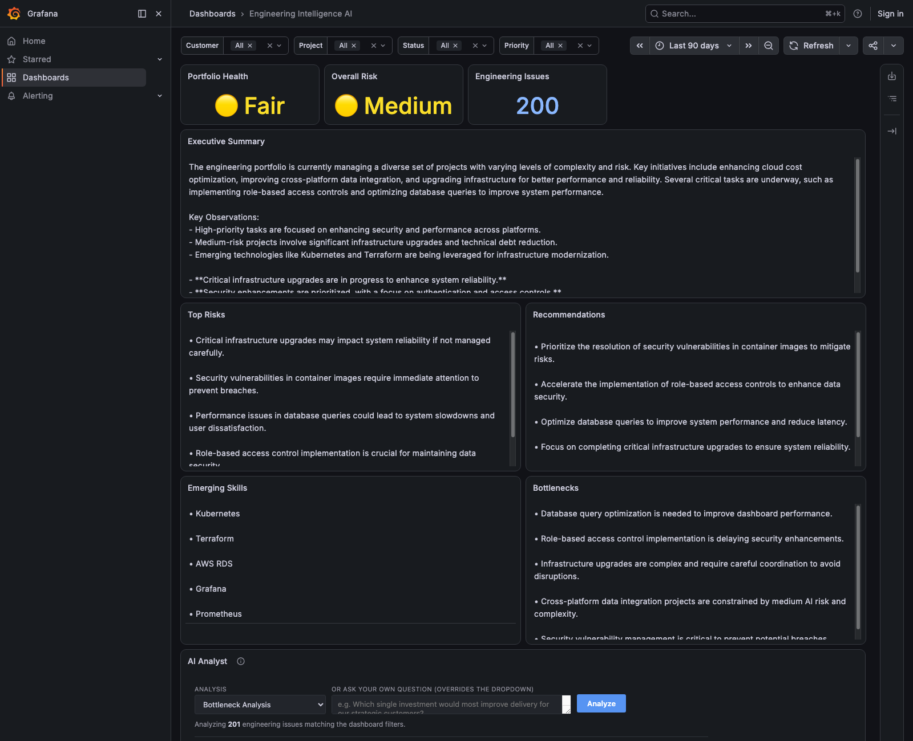

# Engineering Intelligence Platform

An AI-powered engineering analytics platform that combines engineering work items from multiple sources, derives engineering intelligence using OpenAI, and presents executive dashboards in Grafana.

---

## Overview

Engineering Intelligence Platform transforms raw engineering work into actionable insights.

Instead of simply displaying issue counts and project metrics, the platform analyzes engineering activity to identify:

- Portfolio health
- Overall project risk
- Emerging technical skills
- Engineering bottlenecks
- Executive summaries
- Strategic recommendations

The platform currently supports multiple engineering data sources and presents both operational dashboards and AI-generated executive dashboards.

---

## Features

### Engineering Data Collection

- Google Sheets workbook import
- GitHub Issue synchronization
- PostgreSQL storage
- Incremental synchronization

### AI Enrichment

Each engineering issue is automatically enriched with:

- Executive Summary
- Engineering Skills
- Themes
- Complexity
- Risk
- Weight

using OpenAI.

---

### Grafana Dashboards

#### Engineering Overview Dashboard

Operational dashboard showing:

- Engineering Issue Count
- Customers
- Projects
- Skills
- Themes
- Status Distribution
- Priority Distribution
- Skills Leaderboard
- Issue Detail Table

#### Engineering Intelligence Dashboard

Executive dashboard powered by AI.

Displays:

- Portfolio Health
- Overall Risk
- Engineering Issue Count
- Executive Summary
- Top Risks
- Recommendations
- Emerging Skills
- Bottlenecks

Dashboard results automatically respect:

- Customer
- Project
- Status
- Priority
- Time Range

---

## Architecture

```
Google Sheets
        │
        ▼
 ETL Import
        │
        ▼
 PostgreSQL
        │
        ├────────────┐
        ▼            ▼
 GitHub Sync     OpenAI Enrichment
        │            │
        └──────┬─────┘
               ▼
      Engineering Intelligence
               │
               ▼
          Grafana Dashboards
```

---

## Project Structure

```
generator/
    ai/
    enrichment/
    github/
    workbook/
    api.py
    db.py

grafana/
    dashboards/

docs/

README.md
```

---

## Technology Stack

- Python
- PostgreSQL
- Grafana
- Docker
- OpenAI API
- GitHub REST API
- Google Sheets

---

## Installation

### Clone repository

```bash
git clone https://github.com/yourname/engineering-intelligence-platform.git

cd engineering-intelligence-platform
```

---

### Create virtual environment

```bash
python -m venv .venv

source .venv/bin/activate
```

---

### Install packages

```bash
pip install -r requirements.txt
```

---

### Configure environment

Create a `.env` file.

Example:

```text
OPENAI_API_KEY=

GITHUB_TOKEN=

POSTGRES_HOST=
POSTGRES_DB=
POSTGRES_USER=
POSTGRES_PASSWORD=
```

---

### Start PostgreSQL

Docker example:

```bash
docker compose up -d
```

---

## Development Workflow

### 1. Maintain the master workbook

Update engineering issues in Google Sheets.

---

### 2. Export workbook

Save as

```
design/HD_Systems_Design_Workbook.xlsx
```

---

### 3. Build database

```bash
python main.py
```

This rebuilds the Engineering Intelligence database from the workbook.

---

### 4. Synchronize GitHub

```bash
python -m generator.sync_github
```

Imports GitHub Issues and automatically enriches them with AI.

---

### 4b. Batch-enrich remaining issues (optional)

```bash
python tools/enrich_issues.py
```

Runs AI enrichment (complexity, risk, executive summary) for any issue
that does not have it yet. Resume-safe: re-run after interruptions or
rate limits and it picks up where it left off.

---

### 5. Start API

```bash
uvicorn generator.api:app --reload
```

---

### 6. Start Grafana

```bash
docker compose up grafana
```

---

### Utilities

| Command | Purpose |
|---|---|
| `python -m generator.apply_schema` | (Re)creates the full database schema from `sql/` |
| `python tools/generate_issues.py` | Appends realistic synthetic issues to the design workbook |
| `python tools/enrich_issues.py` | Batch AI enrichment for issues missing scores |

### AI Analyst Panel

The Engineering Intelligence AI dashboard embeds an interactive analyst
(served by the API at `/panel`) as an iframe. It inherits the dashboard's
filters and time range from the URL, offers preconfigured analyses
(bottlenecks, risk, skill gaps, workload, executive briefing, customer
health), accepts free-form questions, and streams grounded markdown
answers that cite issue keys.

---

## Screenshots

### Engineering Overview



---

### Customer Insights



---

### Executive Engineering Intelligence



---

## Future Enhancements

- Jira connector
- Azure DevOps connector
- GitLab connector
- Trend analysis
- Team workload forecasting
- Sprint analytics
- Executive PDF generation
- RAG-powered engineering assistant

---

## License

MIT